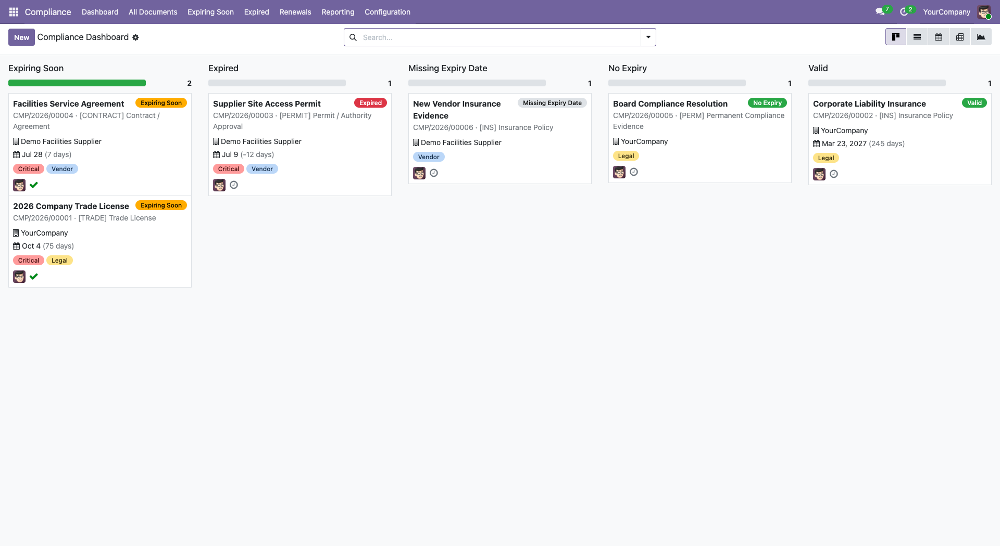
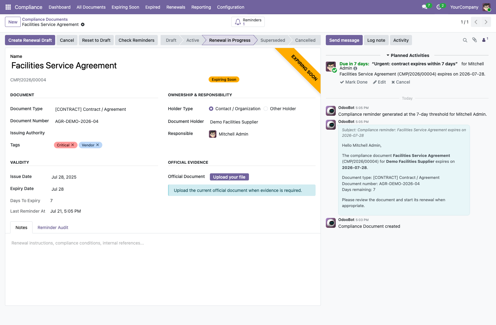
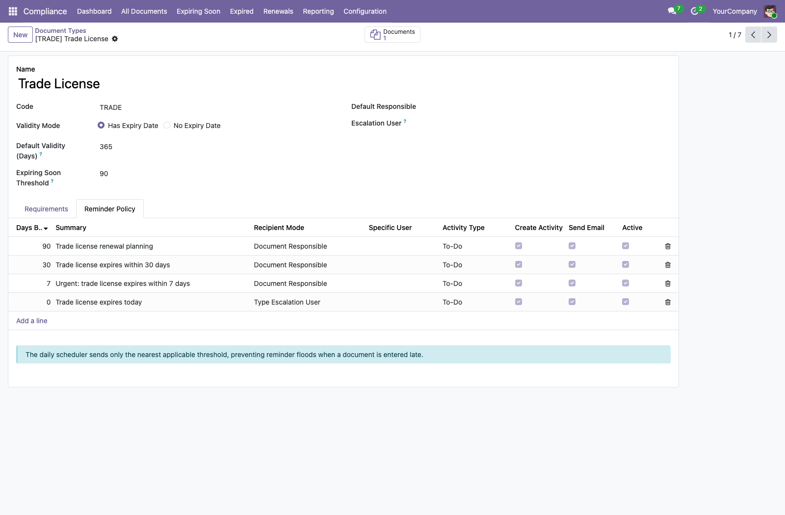
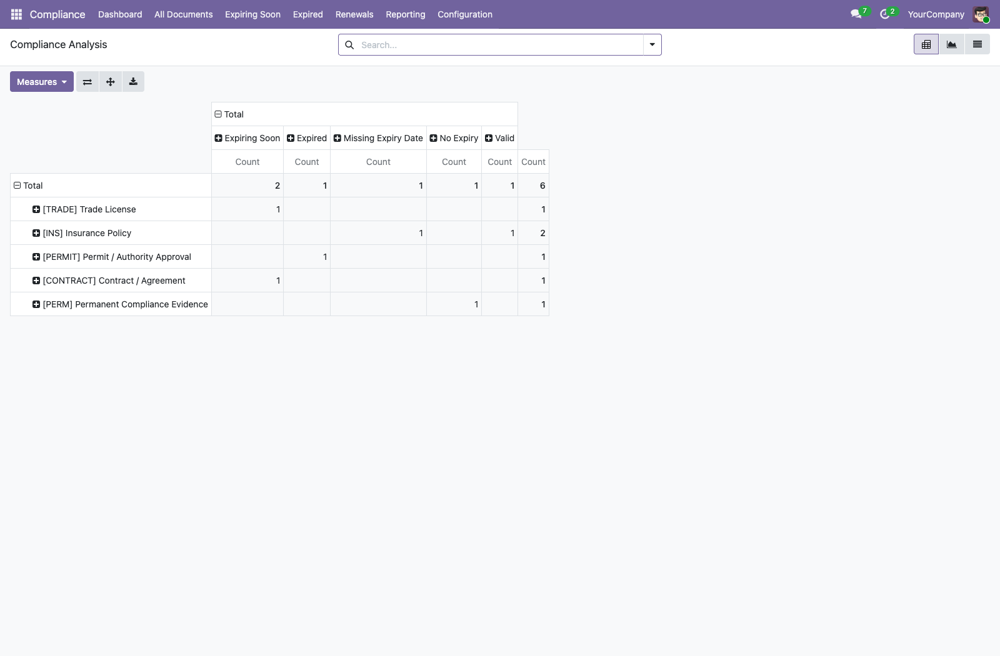

# Compliance Documents for Odoo 18

Centralize licences, permits, insurance policies, certificates, agreements,
identity records, and other time-sensitive compliance evidence in one
auditable Odoo workspace.


## Supported Odoo versions

Each supported Odoo release has a dedicated branch containing its
version-specific Python, security, and view compatibility changes.

| Odoo version | Branch |
| --- | --- |
| 19.0 | [`19.0`](https://github.com/ZetriSofu40/odoo-compliance-document-management/tree/19.0) |
| 18.0 | [`18.0`](https://github.com/ZetriSofu40/odoo-compliance-document-management/tree/18.0) |
| 17.0 | [`17.0`](https://github.com/ZetriSofu40/odoo-compliance-document-management/tree/17.0) |
| 16.0 | [`16.0`](https://github.com/ZetriSofu40/odoo-compliance-document-management/tree/16.0) |
| 15.0 | [`15.0`](https://github.com/ZetriSofu40/odoo-compliance-document-management/tree/15.0) |

Select the branch matching the target Odoo server. Do not install a branch on
a different major Odoo version.

## What the module solves

Compliance evidence often lives across spreadsheets, shared folders, inboxes,
and personal calendars. This module provides a controlled register that makes
document ownership, expiry exposure, reminders, renewals, and historical
evidence visible inside Odoo.

## Highlights

- Configurable document types and evidence requirements.
- Valid, expiring-soon, expired, missing-date, and no-expiry statuses.
- Multi-threshold activities and email reminders with escalation recipients.
- Idempotent daily processing that avoids duplicate reminders.
- Controlled renewal workflow with superseded-document traceability.
- Immutable reminder audit history and protected operational evidence.
- Contact smart buttons, calendar, kanban dashboard, pivot, and graph views.
- Compliance Administrator, Officer, and read-only Auditor access levels.
- Multi-company record separation.
- Automated Odoo tests for lifecycle, reminders, renewals, access, and isolation.

## Screenshots

All screenshots use isolated demonstration data.

### Status dashboard



### Document ownership, renewal, reminders, and evidence



### Configurable reminder thresholds



### Compliance analysis



Additional captures:
[document register](compliance_document_management/static/description/screenshots/03-compliance-documents.png) and
[document types](compliance_document_management/static/description/screenshots/06-document-types.png).

## Requirements

- Odoo 18.0 Community or Enterprise.
- Standard Odoo applications: Contacts and Discuss/Mail.
- No third-party Python packages.

## Installation

Clone the repository and add its root directory to the Odoo addons path:

```bash
git clone --branch 18.0 \
  https://github.com/ZetriSofu40/odoo-compliance-document-management.git
```

The repository contains the module in the stable
`compliance_document_management` technical folder. Add the cloned repository
root to the Odoo addons path, restart Odoo, update the Apps list, and install
**Compliance Documents**.

Command-line installation example:

```bash
./odoo-bin -d <database> \
  --addons-path=addons,/path/to/odoo-compliance-document-management \
  -i compliance_document_management \
  --stop-after-init
```

After installation:

1. Assign Compliance access rights to the appropriate users.
2. Review document types and evidence requirements.
3. Configure reminder thresholds, recipients, and escalation users.
4. Confirm the daily scheduled action is active.

## Running the tests

From an Odoo 18 source checkout:

```bash
./odoo-bin -d <test_database> \
  --addons-path=addons,/path/to/odoo-compliance-document-management \
  -i compliance_document_management \
  --test-enable \
  --stop-after-init
```

## Demo data

The optional demo package provides six synthetic records covering valid,
expiring-soon, expired, permanent, and incomplete scenarios. It does not
contain customer or production data.

## License

Copyright © 2026 Kyaw Thurein Thaung.

This module is licensed under the Odoo Proprietary License v1.0 (`OPL-1`).
The source is publicly visible for evaluation, but use, modification, and
distribution remain governed by the terms in [LICENSE](LICENSE) and
[COPYRIGHT](COPYRIGHT). Public repository visibility does not waive those
terms.

## Author and support

**Kyaw Thurein Thaung**  
Odoo Techno-Functional Consultant  
[Portfolio](https://www.kyawthureinthaung.com) ·
[GitHub](https://github.com/ZetriSofu40) ·
[Email](mailto:kyawthureinthaung40@outlook.com)
